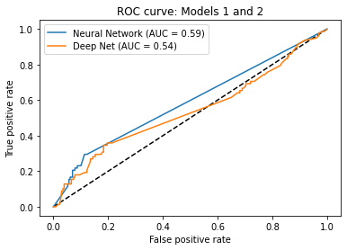
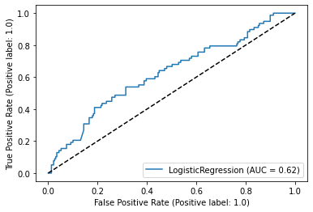

# Default_Risk_Predictor
An analysis of a few different machine learning models that predict risk of default.

Libraries used:  
pandas  
pathlib  
hvplot  
numpy  
scikitlearn  
tensorflow (keras)

We discovered in the middle of development why K-means models are better suited for unsupervised machine learning application.  Because the data is already labeled, it was unnecessary to attempt to find further relationships.

## Model 1: Neural Network Model

Loss: 0.5698222517967224
Accuracy: 0.7491856813430786

## Model 2: Deep-Learning Model

Loss: 0.27021244168281555
Accuracy: 0.27021244168281555

### ROC Curve Models 1 and 2

## Model 3: Logistic Regression Model

Loss: 8.88783105796539
Accuracy: 0.742671009771987

### ROC Curve Model 3

## Conclusion

It seems, based on these statistics, that the best predictor would be the simple neural network model.  The logistic regression model is decently accurate, but it's loss is so high that it cannot make the best predictions.  The neural network model is only slightly better than a random guess, and also has a rather high loss.  

Overfitting and underfitting could not be observed due to the inability to recreate the dataset with new values in the allotted time.